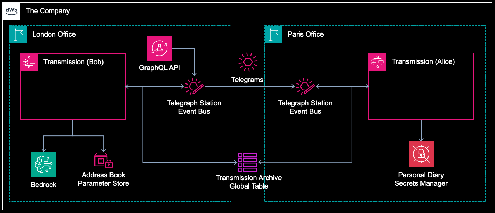

# Alice & Bob Telegrams

Sample functionless application using AWS managed services: EventBridge, Step Functions, DynamoDB, CloudWatch, SSM Parameter Store, Secret Manager, Translate.

## Overview

**Story:** 

Alice and Bob both work for The Company. Alice is based in Paris and Bob is based in London. Alice and Bob are in long distance relationship, navigating work and love across borders. Bob sends to Alice personal and business telegrams. He also translates to French every telegram sent to Alice. Alice loves receiving private telegrams, reacts with an emoji and saves them in Personal Diary.

*Alice and Bob are fictional characters commonly used as placeholders in discussions about cryptographic systems and protocols. Originally introduced in the 1978 RSA paper by Rivest, Shamir, and Adleman.*

## Diagram



## Components

This CDK application deploys 4 CDK stacks in 2 regions:

- TelegraphSharedStack (primary region)
- TelegraphBobStack (primary region)
- TelegraphAliceStack (secondary region)
- TelegraphApiStack (primary region)

Application consists of the following AWS resources:

- DynamoDB global tables
- Step Functions state machines
- EventBridge event buses
- EventBridge event rules
- SSM Parameter Store parameters
- Secrets Manager secret
- CloudWatch log groups
- CloudWatch dashboard
- S3 bucket
- AppSync GraphQL API
- AppSync GraphQL resolvers (VTL)
- WAF WebACL

## Context

Modify the `cdk.context.json` file to change deployment regions:

```json
{
  "regions": {
    "bob": "eu-west-2",
    "alice": "eu-west-3"
  }
  ...
}
```

## Start Engine

To start the application use either AppSync or EventBridge on AWS Management Console. A custom event will be emitted to custom bus, which will trigger execution of the Bob's state machine.

### EventBridge

Send an event on the custom bus in the primary region. 

* Sample event: [send-telegram.json](src/events/send-telegram.json)

### GraphQL API

Call the `sendTelegram` GraphQL mutation to generate a custom EventBridge event in primary region. A custom event will be emitted to custom bus, which will trigger execution of the Bob's state machine.

* Sample mutation: [send-telegram.graphql](src/graphql/send-telegram.graphql)
* Sample query: [get-telegram.graphql](src/graphql/get-telegram.graphql)

## Useful commands

* `npm install`           installs all required NPM packages
* `npm run build`         compiles TypeScript to JavaScript
* `cdk synth --all`       emits the synthesized CloudFormation templates
* `cdk deploy --all`      deploys all stacks to your default AWS account
* `cdk destroy --all`     destroys all stacks from your AWS account
